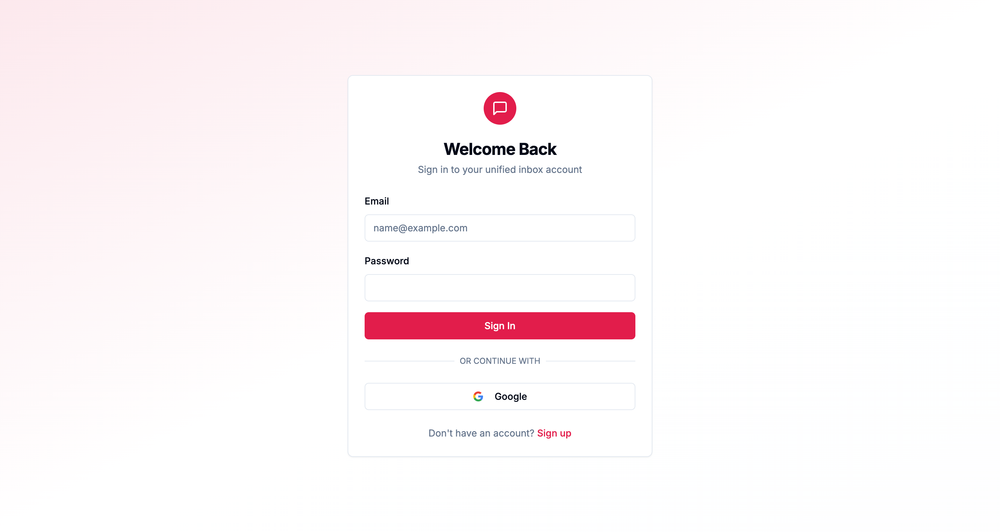
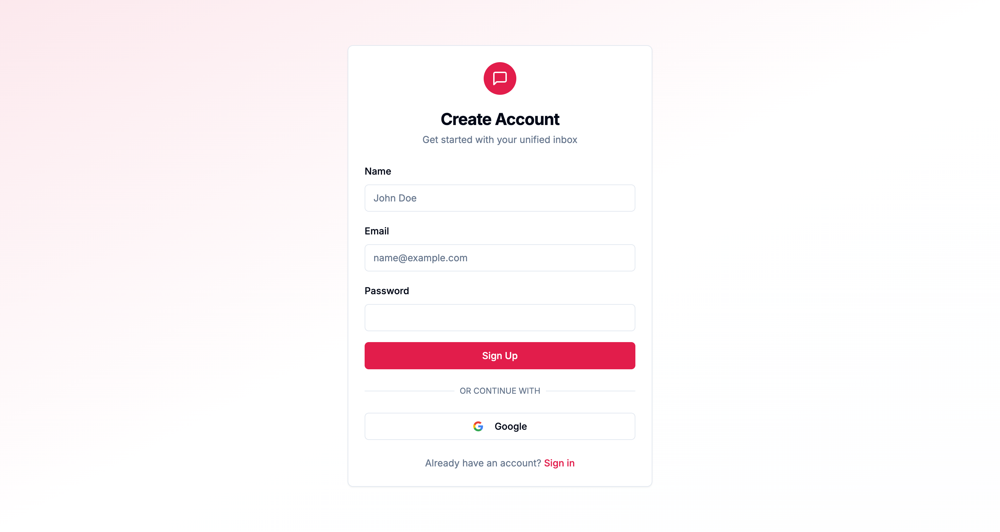
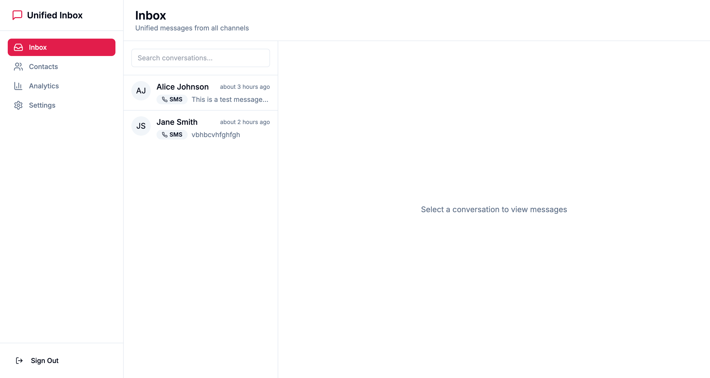
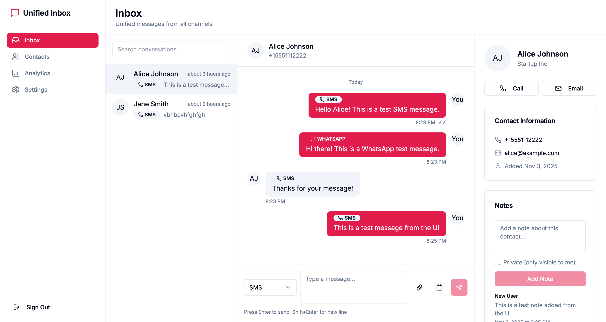
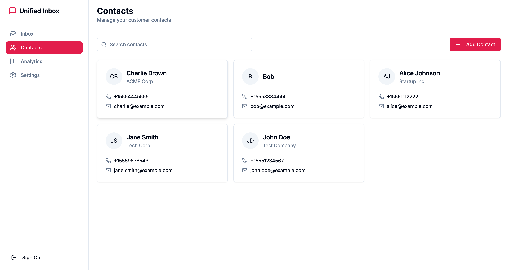
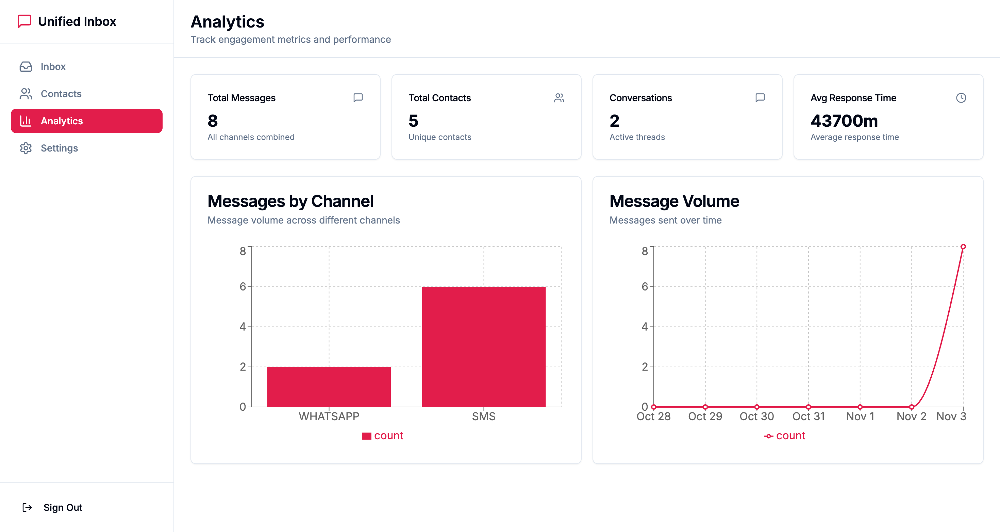
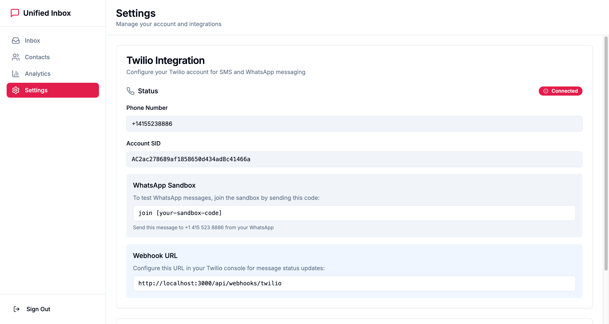
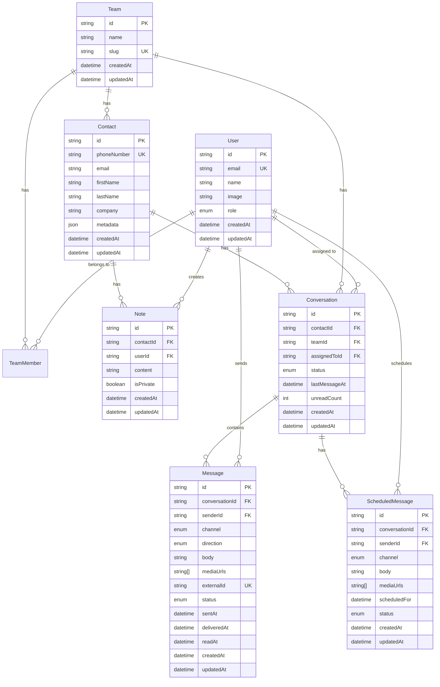

# Unified Multi-Channel Inbox MVP

A full-stack unified communication platform built with Next.js that aggregates messages from SMS (Twilio), WhatsApp (Twilio API), and other channels into a single inbox. Enables seamless outreach, message scheduling, contact management, team collaboration, and analytics.

## 📸 Screenshots

### Home/Login Page

*Clean and modern login interface with Google OAuth support*

### Signup Page

*User registration form with email/password and Google OAuth options*

### Inbox - Conversation List

*Unified inbox showing all conversations with search functionality*

### Conversation View

*Full conversation view with messages, contact details, and notes sidebar*

### Contacts Page

*Contact management interface with search and add contact functionality*

### Analytics Dashboard

*Analytics dashboard for tracking engagement metrics and performance*

### Settings Page

*Settings page showing Twilio integration status and configuration*

### Console & Development Status

The application runs cleanly with no console errors. For detailed console output information, see [Console Output Documentation](screenshots/CONSOLE_OUTPUT.md).

**Status**: ✅ All pages load successfully  
**Console Errors**: None  
**Compilation**: Successful  
**API Routes**: All functional

## Table of Contents

- [Screenshots](#-screenshots)
- [Features](#features)
- [Tech Stack](#tech-stack)
- [Project Structure](#project-structure)
- [Database Schema](#database-schema)
- [Setup Instructions](#setup-instructions)
- [Integration Comparison](#integration-comparison)
- [Architectural Decisions](#architectural-decisions)
- [API Documentation](#api-documentation)
- [Deployment](#deployment)

## Features

### Core Features (MVP)

- ✅ **Unified Inbox**: Kanban-style view with threaded conversations grouped by contact
- ✅ **Multi-Channel Support**: SMS and WhatsApp via Twilio
- ✅ **Send/Reply**: Send messages across channels with channel badges
- ✅ **Contact Management**: Create, search, and manage contacts with auto-merge
- ✅ **Notes System**: Simple shared notes (public/private) on contacts
- ✅ **Message Scheduling**: Schedule messages for future delivery
- ✅ **Analytics Dashboard**: Track message volume, response times, and engagement
- ✅ **Authentication**: Credentials and Google OAuth via Better Auth
- ✅ **Webhook Integration**: Real-time inbound messages and status updates

### Future Enhancements

- Real-time collaboration (WebSockets/SSE)
- Email integration (Resend/IMAP)
- Social media integration (Twitter/X, Facebook Messenger)
- Advanced team management and RBAC
- Contact deduplication with fuzzy matching
- Advanced analytics and reporting

## Tech Stack

- **Frontend/Backend**: Next.js 14+ (App Router, TypeScript)
- **Database**: PostgreSQL (Neon) via Prisma ORM
- **Authentication**: Better Auth (credentials + Google OAuth)
- **Integrations**: Twilio SDK (SMS + WhatsApp Sandbox)
- **UI Components**: Tailwind CSS + shadcn/ui
- **Data Fetching**: TanStack React Query
- **Validation**: Zod
- **Charts**: Recharts

## Project Structure

```
/app
  /api
    /auth              # Better Auth routes
    /webhooks/twilio    # Twilio webhook handler
    /messages          # Message CRUD APIs
    /contacts          # Contact management APIs
    /notes             # Notes APIs
    /analytics         # Analytics endpoints
    /cron              # Scheduled job handlers
  /(dashboard)
    /inbox             # Unified inbox page
    /contacts           # Contacts page
    /analytics          # Analytics dashboard
    /settings           # Settings page
  /components
    /inbox              # Inbox UI components
    /contacts           # Contact management UI
    /composer           # Message composer
    /analytics          # Analytics components
    /settings           # Settings UI
    /layout             # Layout components
    /ui                 # shadcn/ui components
/lib
  /integrations         # Channel integration layer
  /prisma               # Prisma client
  /auth                 # Better Auth config
/prisma
  schema.prisma         # Database schema
```

## Database Schema

### Entity Relationship Diagram



### Key Models

1. **User**: Better Auth integration with role-based access (VIEWER/EDITOR/ADMIN)
2. **Team**: Multi-tenant support (single team for MVP)
3. **Contact**: Normalized contact data across channels
4. **Conversation**: Threads grouped by contact
5. **Message**: Unified message table with channel type
6. **Note**: Simple shared notes on contacts
7. **ScheduledMessage**: Future message sends

## Setup Instructions

**📖 For a detailed, step-by-step setup guide with troubleshooting, see [SETUP_GUIDE.md](./SETUP_GUIDE.md)**

### Quick Start

1. **Install dependencies**:
   ```bash
   npm install
   ```

2. **Set up environment variables**:
   Create a `.env.local` file with your database, Twilio, and auth credentials (see [SETUP_GUIDE.md](./SETUP_GUIDE.md) for details)

3. **Set up database**:
   ```bash
   npm run db:generate
   npm run db:push
   ```

4. **Start development server**:
   ```bash
   # Clear cache if you encounter build errors:
   rm -rf .next
   
   # Start the server:
   npm run dev
   ```

5. **Visit** http://localhost:3000 and sign up to get started!

### Prerequisites

- Node.js 18+ and npm/yarn
- PostgreSQL database (local or cloud like Neon)
- Twilio account with SMS/WhatsApp enabled phone number

For detailed instructions, troubleshooting tips, and step-by-step guidance, please refer to **[SETUP_GUIDE.md](./SETUP_GUIDE.md)**.

## Integration Comparison

### Channel Comparison Table

| Channel | Latency | Cost per Message | Reliability | Features | Best Use Case |
|---------|---------|------------------|-------------|----------|---------------|
| **SMS** | 1-5s | $0.0075 - $0.01 | High (99.9%) | Text, MMS | Direct communication, 2FA |
| **WhatsApp** | 1-3s | $0.005 - $0.009 | High (99.9%) | Text, Media, Interactive | Rich messaging, global reach |
| **Email** | 30s-5m | $0.0001 - $0.01 | Medium (95%) | Rich HTML, Attachments | Long-form, documentation |
| **Twitter/X** | 5-30s | Free (API limits) | Medium (90%) | Text, Media | Public engagement |
| **Facebook** | 3-10s | Free (API limits) | Medium (90%) | Text, Media | Community engagement |

### Decision Rationale

1. **SMS via Twilio**: High reliability, global reach, supports MMS
2. **WhatsApp via Twilio Sandbox**: Rich features, lower cost, better UX for media
3. **Unified Schema**: Normalize all channels into single `Message` table for simplicity
4. **Webhook-based Updates**: Real-time status updates without polling
5. **Polling for Inbox**: Simple polling every 5-10s for MVP (can upgrade to WebSockets)

### Cost Analysis (Twilio Trial)

- **Trial Account**: $15.50 credit
- **SMS**: ~1,500 messages (US) or ~2,000 (international)
- **WhatsApp**: ~3,000 messages
- **Production**: Pay-as-you-go, scales with usage

## Architectural Decisions

### 1. Unified Message Schema

**Decision**: Single `Message` table with `channel` enum instead of separate tables per channel.

**Rationale**:
- Simpler queries and joins
- Easier to add new channels
- Consistent data model
- Single source of truth for conversations

### 2. Server-Side Polling

**Decision**: Use React Query with polling intervals (5-10s) instead of WebSockets/SSE.

**Rationale**:
- Simpler implementation for MVP
- No additional infrastructure (Redis, WebSocket server)
- Easy to upgrade later
- Sufficient for MVP requirements

### 3. Better Auth over NextAuth

**Decision**: Use Better Auth for authentication.

**Rationale**:
- Better TypeScript support
- Simpler API
- Built-in Prisma adapter
- Active development and modern features

### 4. Prisma over Raw SQL

**Decision**: Use Prisma ORM for database operations.

**Rationale**:
- Type-safe queries
- Automatic migrations
- Excellent developer experience
- Strong TypeScript integration

### 5. Shadcn/ui over Material-UI

**Decision**: Use shadcn/ui component library.

**Rationale**:
- Tailwind CSS integration
- Copy-paste components (no npm dependency)
- Customizable and accessible
- Modern design system

### 6. React Query for Data Fetching

**Decision**: Use TanStack React Query for all API calls.

**Rationale**:
- Built-in caching and refetching
- Optimistic updates
- Automatic background refetching
- Excellent loading/error states

### 7. Simple Notes (No Real-time Collaboration)

**Decision**: Simple last-write-wins notes instead of operational transforms.

**Rationale**:
- MVP scope constraint
- Simpler implementation
- Can add real-time collaboration later
- Sufficient for basic use cases

### 8. Background Job for Scheduled Messages

**Decision**: API route with cron instead of queue system (Redis/Bull).

**Rationale**:
- No additional infrastructure
- Works with Vercel Cron
- Simple to implement
- Can upgrade to queue later if needed

## API Documentation

### Authentication

- `POST /api/auth/sign-in/email` - Sign in with email/password
- `POST /api/auth/sign-up/email` - Sign up with email/password
- `GET /api/auth/sign-in/social?provider=google` - OAuth sign in
- `POST /api/auth/sign-out` - Sign out

### Messages

- `GET /api/messages` - List all conversation threads
- `GET /api/messages/[conversationId]` - Get messages in a conversation
- `POST /api/messages/send` - Send a message
- `POST /api/messages/schedule` - Schedule a message
- `GET /api/messages/schedule` - Get scheduled messages
- `DELETE /api/messages/schedule/[id]` - Cancel scheduled message

### Contacts

- `GET /api/contacts` - List contacts (supports ?search= query)
- `POST /api/contacts` - Create a contact
- `GET /api/contacts/[id]` - Get a contact
- `PATCH /api/contacts/[id]` - Update a contact

### Notes

- `GET /api/contacts/[id]/notes` - Get notes for a contact
- `POST /api/contacts/[id]/notes` - Create a note
- `PATCH /api/notes/[id]` - Update a note
- `DELETE /api/notes/[id]` - Delete a note

### Analytics

- `GET /api/analytics` - Get analytics data

### Webhooks

- `POST /api/webhooks/twilio` - Twilio webhook handler

### Cron

- `GET /api/cron/process-scheduled` - Process scheduled messages

## Deployment

### Vercel Deployment

1. Push code to GitHub
2. Import project in Vercel
3. Add environment variables
4. Configure database (Neon recommended)
5. Set up Vercel Cron for scheduled messages

### Environment Variables for Production

```env
DATABASE_URL=postgresql://...
BETTER_AUTH_SECRET=strong-secret-here
BETTER_AUTH_URL=https://your-domain.com
TWILIO_ACCOUNT_SID=...
TWILIO_AUTH_TOKEN=...
TWILIO_PHONE_NUMBER=...
CRON_SECRET=strong-secret-for-cron
```

### Database Migrations

```bash
npm run db:migrate
```

## Development

```bash
# Install dependencies
npm install

# Run development server
npm run dev

# Generate Prisma Client
npm run db:generate

# Push schema changes
npm run db:push

# Open Prisma Studio
npm run db:studio

# Lint
npm run lint

# Format
npm run format
```

## Known Limitations (MVP)

1. **No Real-time Updates**: Using polling instead of WebSockets/SSE
2. **Single Team**: Multi-tenant support exists but single team for MVP
3. **Simple Notes**: No conflict resolution, last-write-wins
4. **No Email Integration**: Only SMS and WhatsApp
5. **No Social Media**: Twitter/Facebook not implemented
6. **Basic Search**: Full-text search not implemented
7. **No Media Upload**: Media URLs must be provided (Twilio URLs)

## Future Enhancements

- [ ] Real-time collaboration with WebSockets
- [ ] Email integration (Resend/IMAP)
- [ ] Social media channels (Twitter/X, Facebook)
- [ ] Advanced search with Algolia/Prisma full-text
- [ ] Contact deduplication with fuzzy matching
- [ ] Team management and RBAC
- [ ] Advanced analytics and reporting
- [ ] Mobile app (React Native)
- [ ] API for third-party integrations

## License

MIT

## Author

Built for Attack Capital Assignment
